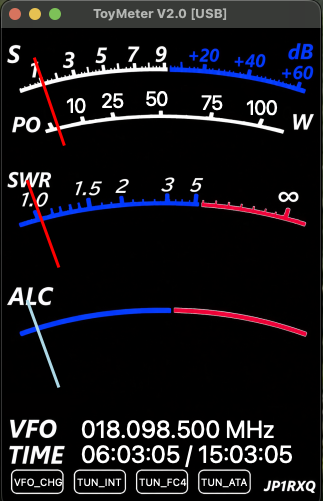
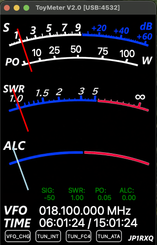

# toy_meter

**Radio Signal Power Meter using Hamlib / rigctld**

toy_meter is a simple meter application for amateur radio operation.

It uses Hamlib `rigctld` to communicate with supported transceivers and displays signal and operating information such as **SIG / PO / SWR / ALC**, as well as the operating frequency.

**Version: 2.0**

**Developer: JP1RXQ**

---

## Features

- SIG / PO / SWR / ALC meter display
- Operating VFO frequency display
- UTC / Local Time display
- Custom FNC functions for YAESU CAT commands
- PO / ALC reference calibration
- USB Serial connection using Hamlib `rigctld`
- Network connection to a remote `rigctld`
- Multiple radio support
- Support for small-display environments such as Raspberry Pi
- Setup screen with Radio Parameters, About toy_meter, and Configuration Diagram


## Meter Panel

### Normal Mode



The Normal mode is the standard display for everyday operation.

### Monitor Mode



The Monitor mode provides additional information for setup,
calibration, and troubleshooting. The `rigctld` port currently
assigned to the USB Serial connection is also displayed in the
meter panel title.

---

## Connection

toy_meter communicates with the transceiver through Hamlib `rigctld`.

There are two connection modes.

### USB Serial (Server)

Connect the transceiver directly to the local computer using a serial connection.

In this mode, toy_meter starts and manages `rigctld` locally.

The local `rigctld` operates as a Server, allowing other applications or computers to connect to it through the configured TCP port.

The default port is:

```text
4532
```

For multiple USB-connected radios on the same computer, toy_meter can automatically use the following ports:

```text
4532
4534
4536
4538
```

Up to four USB Serial (Server) instances can be operated simultaneously on the same computer, provided that each radio uses a separate serial port.

When multiple toy_meter instances are running, the currently used `rigctld` port can be checked in **Monitor** or **Debug** mode.

The port number is displayed in the meter panel title, for example:

```text
ToyMeter V2.0 [USB:4532]
```

To operate multiple toy_meter instances, make separate copies of the application directory and give each copy an appropriate name, for example:

```text
toy_meter_FTDX10
toy_meter_FT818
```

### Network rigctld (Client)

Connect to a `rigctld` server running on another computer through the network.

Example:

```text
HOST: 192.168.1.100
PORT: 4532
```

`4532` is the default TCP port commonly used by `rigctld`.

In this mode, toy_meter does not use the local serial port.

---

## Setup

The Setup screen provides three pages:

- **Radio Parameters**
- **About toy_meter**
- **Configuration Diagram**

### Connection Type

| Connection Type | Description |
|---|---|
| USB Serial (Server) | Connects to a local radio through a serial port and starts a local `rigctld` server |
| Network rigctld (Client) | Connects to a `rigctld` server running on another computer |

### Radio Parameters

The following parameters can be configured according to the connected radio and operating environment:

- MFG
- MODEL
- RIG MODEL
- SERIAL PORT
- BAUD RATE
- DATA BITS
- PARITY
- STOP BITS
- FLOW CONTROL
- RF POWER RANGE
- SCAN_SP
- RF REFERENCE
- ALC REFERENCE
- FNC1 - FNC4

### Operating Mode

| Mode | Description |
|---|---|
| Normal | Normal operating mode |
| Monitor | Displays communication and meter information for checking the radio and calibration |
| Debug | Detailed diagnostic information for troubleshooting |

The **Monitor** mode can also be used to check the `rigctld` port currently assigned to a USB Serial (Server) connection.

`Debug` mode is intended for troubleshooting and may result in slower response during normal operation.

---

## PO / RF Reference Calibration

The PO meter may show different values depending on the transceiver and Hamlib implementation.

If necessary, the PO meter can be calibrated using the RF Reference value.

Basic procedure:

1. Set `OPERATING MODE` to `Monitor`.
2. Transmit at approximately 25% of the radio's maximum output power.
3. FM mode is recommended for calibration.
4. Click the green `PO` indication to perform calibration.
5. If necessary, adjust the reference value manually.

The displayed PO value should be regarded as an approximate indication rather than a precision measurement.

---

## ALC Reference Calibration

ALC values can also differ significantly between transceiver models.

If necessary, the ALC meter can be calibrated using the ALC Reference value.

Basic procedure:

1. Set `OPERATING MODE` to `Monitor`.
2. Transmit while adjusting the radio to a level slightly below the upper limit of the radio's appropriate ALC range.
3. Click the green `ALC` indication to perform calibration.
4. If necessary, adjust the reference value manually.

When using digital modes such as WSJT-X, calibration using the actual operating environment is recommended.

> **Note:** PO and ALC indications depend on the transceiver model and Hamlib implementation. Use them as reference values rather than precision measurements.

---

## Serial Port Settings

For USB Serial (Server) connections, configure the serial communication parameters according to the connected radio:

- SERIAL PORT
- BAUD RATE
- DATA BITS
- PARITY
- STOP BITS
- FLOW CONTROL

### SCAN_SP

`SCAN_SP` controls the interval used for meter updates.

Typical values are:

```text
0.1 - 0.5
```

A smaller value generally provides faster meter response, but increases communication frequency.

A larger value may be preferable for older computers, Raspberry Pi systems, older transceivers, or slower serial connections.

If communication repeatedly fails, the Setup screen may be opened automatically so that the connection settings can be checked.

---

## Custom Functions

The FNC function provides user-defined controls for YAESU CAT commands.

Up to four functions can be configured:

```text
FNC1
FNC2
FNC3
FNC4
```

Each function consists of a label and a CAT command.

| Parameter | Description |
|---|---|
| Label | Display label |
| Command | CAT command |

### Notes

- Commands requiring a response are not supported.
- Commands that take a long time to complete may affect communication with the radio.
- Users should understand the CAT command specifications of their transceiver before configuring custom functions.
- Operation with transceivers other than YAESU is not guaranteed.

---

## Multiple Radios

Multiple toy_meter instances can be operated on the same computer in USB Serial (Server) mode.

The available `rigctld` ports are:

```text
4532
4534
4536
4538
```

Each radio must use its own serial port.

For example:

```text
Radio 1 → USB Serial → 4532
Radio 2 → USB Serial → 4534
Radio 3 → USB Serial → 4536
Radio 4 → USB Serial → 4538
```

The actual port assigned to each instance can be checked in Monitor or Debug mode.

When using multiple instances, make separate copies of the toy_meter application directory and give each copy an appropriate name.

---

## Network Operation

Network operation allows toy_meter to connect to a `rigctld` server running on another computer.

For example:

```text
Radio
  │
  │ Serial
  ▼
Computer A
  │
  │ rigctld
  │ TCP 4532
  ▼
Network
  │
  ▼
Computer B
  │
  │ toy_meter
```

The network connection is configured using the `RIGCTLD_HOST` and `RIGCTLD_PORT` parameters.

---

## Supported Environment

toy_meter is intended for environments where Python, PyQt6, and Hamlib `rigctld` are available.

The following environments have been tested:

- macOS
- Windows 11
- Linux
- Raspberry Pi OS

Raspberry Pi systems with small displays can also be used.

### Raspberry Pi

toy_meter has been tested with Raspberry Pi systems using a small TFT display.

The detailed TFT display installation and system-specific startup configuration are environment dependent and are not included in this README.

Users should first configure their Raspberry Pi display and operating system so that the required PyQt6 display environment is available.

---

## Recommended SCAN_SP

The following values are reference values only.

| Environment | Recommended SCAN_SP |
|---|---:|
| Apple Silicon | 0.1 - 0.2 |
| Windows 11 | 0.1 - 0.2 |
| Raspberry Pi 3B+ | 0.3 - 0.5 |
| 9600 bps | 0.3 - 0.5 |
| 38400 bps | 0.1 - 0.3 |

The appropriate value depends on the computer, Raspberry Pi, transceiver, serial communication speed, and operating environment.

---

## Troubleshooting

### Communication fails after startup

Check the following:

1. Confirm the selected connection type.
2. Check the radio model and RIG MODEL.
3. Check the serial port.
4. Check the serial communication parameters.
5. For Network rigctld connections, check the host address and TCP port.
6. For USB Serial connections, check whether the serial port is already being used by another application.
7. Use **Monitor** or **Debug** mode to check communication information.

If communication repeatedly fails, toy_meter may open the Setup screen automatically.

---

## Important Notes

toy_meter is an **auxiliary meter application, not a precision measuring instrument**.

In particular, PO and ALC values may differ between transceiver models because of differences in the values provided by the transceiver and the Hamlib implementation.

Displayed values should therefore be regarded as reference values.

The author is not responsible for any damage to a transceiver, computer, or other equipment, or for data loss resulting from the use of this software.

**Use this software at your own responsibility.**

---

## License

toy_meter is licensed under the **Mozilla Public License 2.0 (MPL-2.0)**.

Copyright (c) 2026 JP1RXQ

See the [`LICENSE`](LICENSE) file for the full license text.

---

## Credits

**Developer**

JP1RXQ

**Evaluation / Testing**

JR2ANC
7K1AEU

**Development Support**

ChatGPT Support

---

## Disclaimer

toy_meter is provided as-is without warranty.

The software is intended as an auxiliary display for amateur radio operation and is not a precision measuring instrument.

Use the software at your own responsibility.

---

**toy_meter Version 2.0**

Developed by **JP1RXQ**
